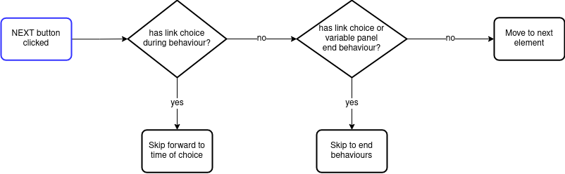
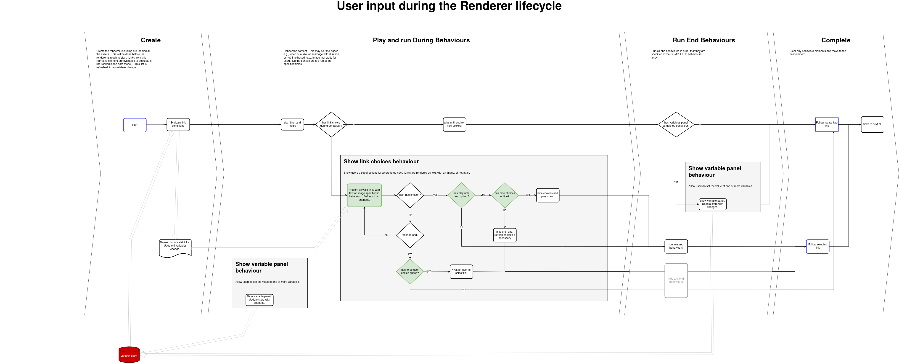

StoryPlayer
======

StoryPlayer is R&D's Object-based Media Player.  It is designed to read stories that are expressed using the [Data Model](https://github.com/bbc/object-based-media-schema) and render the experience within an HTML `<div>` element, responding to audience interactions as and when.

You may be wondering why the term "_romper_" appears so frequently.  This is historical and is because the player was initially called Romper, an acronym for **R**&D **O**bject based **M**edia **P**lay**ER**.  The name was changed to StoryPlayer, to better fit with the naming conventions of the StoryKit suite of tools, but _romper_ remains in many places in the code.

How to use
----------

[romper.js](src/romper.js) exports an `init()` function that is used to initiate StoryPlayer and returns an instance of StoryPlayer.  It takes one argument, defining the Player settings, which has the following attributes:

* `target` - An HTML element for the player to live in.
* fetchers - functions that take a UUID and return an Object describing an instance of the data model for the given experience.
  - `storyFetcher` - returns a [`story`](https://github.com/bbc/object-based-media-schema#story)
  - `narrativeElementFetcher` - returns a [`Narrative Element`](https://github.com/bbc/object-based-media-schema#narrative-element)
  - `representationCollectionFetcher` - returns a [`Representation Collection`](https://github.com/bbc/object-based-media-schema#representation-collection)
  - `representationFetcher` - returns a [`Representation`](https://github.com/bbc/object-based-media-schema#representation)
  - `assetCollectionFetcher` - returns an [`Asset Collection`](https://github.com/bbc/object-based-media-schema#asset-collection)
* `mediaFetcher`  - A function that takes a URI for some media and returns a URL that can be given, for example, as a `src` attribute for a `<video>` element
* `staticImageBaseUrl` - The location of some static assets used by the player (specifically image assets to used if not defined in the story)
* `analyticsLogger` (optional, defaults to logging on the browser console) - A function that processes analytics data Objects; see [below](#analytics).  For example, the function might save the information into a database
* `dataResolver` (optional, defaults to creating one) - contains `get` and `set` functions to get and set the values of the variables that determine the flow of logic of the story (see the [built-in DataResolver](src/resolvers/ObjectDataResolver.js)).  This can be used to hook the player into an external data store
* `privacyNotice` (optional, defaults to null) - A string rendered alongside the start button and start image designed to present a privacy warning to users
* `saveSession` (optional, defaults to false) - A boolean to say whether or not the player should save state and offer to resume when restarted
* `handleKeys` (optional, defaults to true) - A boolean to say whether keyboard events should be handled by the player

For example, in a React application import the player:

```
import Storyplayer, { VARIABLE_EVENTS,  REASONER_EVENTS } from '@bbc/storyplayer';
```

Initiate it using an Object with the attributes described above:
```
    const playerSettingsObject = {
        // an Object including the above attributes
    }
    this.storyplayer = Romper.init(playerSettingsObject);
```

The returned instance will fire events that can be listened for and handled.  For example:

```
    // whenever a variable is changed
    this.storyplayer.on(VARIABLE_EVENTS.VARIABLE_CHANGED, this.handleVariableChange);

    // whenever the user changes to a new Narrative Element
    this.storyplayer.on(REASONER_EVENTS.NARRATIVE_ELEMENT_CHANGED,
        this.handleNarrativeElementChange);

    // whenever the Controller calculates what elements can come next
    this.storyplayer.on(REASONER_EVENTS.NEXT_ELEMENTS, this.handleUpcomingChange);

    // the story is started
    this.storyplayer.on(REASONER_EVENTS.ROMPER_STORY_STARTED, this.handleStoryStart);

    // the story has ended
    this.storyplayer.on(REASONER_EVENTS.STORY_END, this.handleStoryEnd)
```

The [demo index page](examples/index.html) shows how this might work in a static HTML context, with simple fetchers all reading from the same single pre-loaded JSON file for the story.

### URL Parameters for Playback
Two URL parameters can be used to set the state of one variable for playback.  These could be used, for example, to send a link that plays a particular version of a story.  Two parameters are both required:
- varName - the name of the variable.  This must be a variable defined in the story or one of the first two [internal variables](#internal-variables) below: `_portion_of_day` or `_day_of_week`.
- varVal - the value of the variable.  This must conform to the variable type. e.g., `true` or `false` for a boolean, a member of a `list` variable, etc.


### URL Parameters for Debugging
Below are the URL parameters that can be used to toggle features in StoryPlayer.  These are primarily related to debugging.
- overridePlayout - Takes 'ios' or 'dom'. Sets the playout engine.
- debugPlayout - Takes 'true' or 'false'. Increases debugging in playout engines, and renders scrub bar.
- inactiveBufferingOverride - Takes number in seconds. Changes the number of seconds to buffer inactive media.
- activeBufferingOverride - Takes number in seconds. Changes the number of seconds to buffer media currently playing.
- shakaDebugLevel - Takes 'vv', 'v', 'debug' or 'info'. Sets debug level of Shaka when debugPlayout is on.
- disableLookahead - 'true' Stops preloading of next/previous elements
- addDetails - Takes 'true' this inserts the Narrative element name and Id onto the GUI layer in the top right of the player.
- overridePlayoutFormat - Takes either 'hls' or 'dash' Other values are ignored.
- cache - 'true'/'false' Only on sandbox and test. Toggles whether to fetch the story from the cache or S3 buckets

How to develop
--------------

* We use [Yarn](https://yarnpkg.com/en/) for dependency management, Mocha as a test runner with Chai for assertions.
  TDD is preferred here. We have an ESLint file which follows our house file, and we prefer to have Facebook Flow
  annotations in place for type checking.

* Pre-requisites.  In order to get a local version of StoryPlayer running, you will need:
    1.  To download the repo
    2.  Ensure yarn is installed
    3.  Have a Forge certificate
    4.  Set up [Artifactory to run locally](https://confluence.dev.bbc.co.uk/display/PRODTOOLS/Set+up+Artifactory+outside+Sandbox)
* Run `yarn` to get all your dev dependencies included
* `demo.html` puts a simple player onto a page
* `yarn build` will do a single build of the library
* `yarn test` will do a single run of the tests (Mocha with Chai, ESLint and Flow type checking)
* `yarn dev` will do continuously build and test the library on change

Running a local StoryPlayer with local stories/media
--------------

* The StoryPlayer code should be placed behind a Web Server, e.g., by running `python -m http.server` (python3 only) in the root directory of the code.

* The media can be placed in the `/examples/` folder.  It can be put directly in, or organised into subfolders.

* The story json can be placed in the `/examples/` folder.  The json must conform with the [schema](https://github.com/bbc/object-based-media-schema); there are stories in the examples folder there can provide some guidance or be edited manually for testing and exploration.   The Asset Collection source values can use a relative path to the local folder containing the media.  For example, if you are editing `my_story.json` in the `/examples/` folder, and wish to use the video `/examples/my_project/my_nice_vid.mp4`, then the asset collection should have:

```
    "assets": {
        "av_src": "./my_project/my_nice_vid.mp4"
    }
```

* Stories can be played by visiting `localhost:8000/examples/` (the server prefix may vary depending on your local web server - this should work if you have used python, as above); there you will see a list of the example stories provided in the repository.  Select a story in the "Select story" tab then visit the "Render" tab to play.

* Other stories can be viewed by providing the filename in the URL, e.g.,  `localhost:8000/examples/index.html?storyjson=my_story.json`.


Internal Variables
------------------

StoryPlayer creates and manipulates some variables as it runs.  These are available for authors to query to control the story logic (e.g., a representation or a link condition can depend on the state of one or more of these).  The variables are as follows:

* `_day_of_week`: the day of the week (according to the client computer) at the time the experience was loaded.  A string that takes one of the following values:
    - `Sunday`
    - `Monday`
    - `Tuesday`
    - `Wednesday`
    - `Thursday`
    - `Friday`
    - `Saturday`
* `_portion_of_day`: the approximate time of day (according to the client computer) at the time the experience was loaded.  A string that takes one of the following values:
    - `Morning`: before 1200
    - `Afternoon`: between 1200 and 1659
    - `Evening`: after 1700
* `_path_history`: an array of UUIDs of the Narrative Elements that the user has visited so far.  If a user goes back in a story, that UUID is removed from the list.
* `_location_longitude`: the most recent record of the direction of view that the user has taken in a 360 scene (video or image).  This is a number variable which represents the view in the left-right dimension, expressed in degrees, and takes values between 0 and 359.  The player records this variable value every 2 seconds.
* `_location_latitude`: the most recent record of the direction of view that the user has taken in a 360 scene (video or image).  This is a number variable which represents the view in the up-down dimension, expressed in degrees, and takes values between -90 and 90.  The player records this variable value every 2 seconds.
* `_random_number`: returns a random number between 0 and 100 each time it is requested (i.e., the number does not persist across the story)


Document Object Model
---------------------
The following diagram shows how the HTML elements that make up StoryPlayer are organised.  The elements are labelled with their primary CSS class name.  The blue `target` node at the root of the tree is the `<div>` that is passed into StoryPlayer when it is initiated.


Code Components and Data Flow
-----------------------------

The logic of processing the [data model](https://github.com/bbc/object-based-media-schema) is shown in [this diagram](https://github.com/bbc/object-based-media-schema#story-logic-flow).  This section briefly describes how the responsibilities for performing that are allocated amongst the different code components of StoryPlayer.

### Story Control

Each instance of StoryPlayer is an instance of a `Controller` that is created by `romper.js`.  This creates a `RenderManager`, which handles rendering of content, and two reasoners for determining which content is shown.  The `StoryReasoner` is responsible for evaluating links between Narrative Elements to determine which is taken (the first link in the array whose conditions evaluate to true), while the `RepresentationReasoner` is responsible for determining which Representation is rendered for a given Narrative Element (again, the first Representation in the RepresentationCollection whose conditions evaluate to true).  Both reasoners use a `DataResolver` that is passed in to StoryPlayer (although there is a default that is used if one is not provided); this is essentially the variable store.  Also passed in to StoryPlayer are:

* Story Fetchers, which fetch objects of the story data model from the Media Store
* A Media Fetcher, which handles fetching media assets (e.g., from CDNs)
* An Analytics Logger, which takes Analytics Events and processes them (e.g., write to a DB)

The `Controller` also determines whether the system meets the story requirements (as defined in the story meta), tests if the story is linear (and, if so, creates the chapter markers using the representation icons) and handles movement between elements of the story.

The `RenderManager` is responsible for creating and managing the Renderers that display each Narrative Element.  This involves using the `RepresentationReasoner` to determine which Representation will be used, then using the `RendererFactory` to find a Renderer that is capable of rendering it.  In order to achieve smooth playback, it also creates renderers for current, previous and next Narrative Elements so these are ready to play as soon as the story moves on to the next NarrativeElement (a change in the variable state requires these to be refreshed as the particular representation that should be played depends on the state of the variables).  The `RenderManager` creates a `Player` that all Renderers use, and which is responsible for creating the UI and handling the HTML/DOM that the browser displays.

#### Resume State
StoryPlayer uses local storage to record how far a user has got through an experience and the state of their variables.  When they revisit the page they will be given the opportunity to resume from where they were or to restart.  This option can be disabled by initiating StoryPlayer with the `saveSession: false` attribute; in this case the user will always start from the beginning of the story.

The `Controller` creates a `SessionManager` to handle this, which lasts for the duration of the page. When the page is reloaded the `SessionManager` is created again; the controller will check the existing state of the session and give the user options to resume current session or restart and create a new session.

The session state is one of the following enums 
- ```'NEW'```: There is a new session created.
- ```'EXISTING'```: There is an existing session that can be resumed.
- ```'RESUME'```: A Session has been resumed
- ```'RESTART'```: The session will restart from a fresh.

Note that the session manager handles creating the session and fetching the existing session from the local storage. Handling variables data during the session is handled by the `DataResolver`.

### Rendering the UI
The `Player` builds the DOM tree for rendering the content and the UI.  It handles the overlay system, which is used to display multiple volume controls, chapter icons (for switching Narrative Elements), Representation icons (for switching Representations in a Switchable Representation).  It manages the Scrub Bar so it is associated with the appropriate video/audio and the rendering of icons to represent branch choices (the `Player` manages the rendering of these, but the logic is controlled from within the Renderer that is handling the Representation with which this behaviour is associated).  The `Player` creates and handles a `PlayoutEngine` that handles changes of AV media; either by handling multiple video elements or by changing the src of a single element.

### Renderer Lifecycle
The basic lifecycle of a renderer is shown below:


The `BaseRenderer` is the base class for all the Renderers and handles concerns that are common to all.  The rough lifecycle is that constructing a Renderer builds the necessary components for it to play (e.g., a `SimpleAVRenderer` fetches the media assets and gets the `PlayoutEngine` to queue them up).  When the Controller tells the RenderManager to change to the NarrativeElement that the Renderer is handling, the `willStart()` function is called.  This tells the `BehaviourRunner` to run any start behaviours for the Representation and the `PlayoutEngine` to move on to this media.  Once the behaviours have all completed, the `start()` function is called, which clears any behaviour DOM elements and starts rendering (e.g., video playback commences).  It also tests for during behaviours and queues these to run at the appropriate time.  The Renderer is responsible for ending itself, which is done by running the `complete()` function, e.g., when the video has completed.  The `complete()` function asks the `BehaviourRunner` to run any completed behaviours; once these have completed, the Renderer emits a COMPLETED event, which is heard by the RenderManager and passed on to the Controller.  The Controller then tells its StoryReasoner to move on to the next element; this fires events which the Controller listens for and handles, e.g., to tell the RenderManager handle a change in NarrativeElement.  The renderer's `destroy()` function is called when it is no longer either playing or held in the RenderManager's 'buffer' of next and previous NarrativeElements.  The Renderer uses a `TimeManager` to monitor time passing during the main part of the renderer lifecycle.  This monitors absolute time elapsed (compensating for time spent paused or with the window invisible) and allows DURING behaviours to occur at a set time into the element both for representations that have a natural timeline (e.g., video) and those that don't (e.g., image).

The diagram below extends the simple overview (above) to show the functions that are called to start each phase of the lifecycle and the events that are sent to the RenderManager that allow it to call them at the appropriate times.  For example, when a renderer has completed all its COMPLETED behaviours, it will fire the `COMPLETED` event to the RenderManager, which will call the `end()` function on the renderer and move to the next Narrative Element.


#### Behaviours
[Behaviours](https://github.com/bbc/object-based-media-schema#behaviours) are associated with Representations in the Data Model, and can be run at the start, middle, or end of an Element.  They are handled by the Renderer for the given Representation; this uses a `BehaviourRunner` to run the behaviours.  The BehaviourRunner passes each behaviour to the `BehaviourFactory`; which returns a `Behaviour` that is capable of handling it.  Some (e.g., pause) are generic enough to be handled by their own class for all Renderer types; other behaviours can only be handled by certain Representation types, or need to be handled differently for different Representation types; these are handled by the `BaseBehaviour`, which basically passes responsibility on to the Renderer for the Representation.  Each Renderer has a map that associates functions with the URNs of the behaviours it can handle; the function is called when the behaviour needs to be run and runs a callback when it is completed.  The behaviours are considered complete when all of those which are capable of being run have run their callbacks.

### Interpretation of User Interactions
There is considerable complexity in how user interactions influence the lifecycle.  For example, if a link choice behaviour has been applied to a Representation, what should the Next button on the transport bar do?  The following diagrams are intended to capture how StoryPlayer works.

#### Transport controls




#### Interaction with behaviours
The variables panel and link choice behaviours both allow for user interaction.  The following diagram shows how this affects the renderer lifecycle in StoryPlayer.




Analytics
---------

StoryPlayer generates analytics events so that we can record what users are doing.  These are handled by a function that is passed into StoryPlayer; this function might write some or all of these events into a database.  This function takes a single argument, which is a JavaScript Object containing the data.  This Object has the following attributes:

* `type` - String giving event type (see below for details)
* `name` - String giving event name (see below for details)
* `from` - String representing 'from' state
* `to` - String representing 'to' state
* `current_narrative_element` - UUID of current Narrative Element
* `current_representation` - UUID of current Representation
* `data` - Object with other information about the event (see below for details)

### Event Types

Events are classified into the following types:

* `STORY_NAVIGATION` - A change in the state of story
* `RENDERER_ACTION` - the renderer has done something
* `USER_ACTION` - the User has done something
* `SEGMENT_COMPLETION` - A NarrativeElement has been completed

Each of these are described in a little more detail below, with the names of all the events that live in each.

### `STORY_NAVIGATION`
| name | meaning | from | to | data |
| -- | -- | -- | -- | -- |
| `NARRATIVE_ELEMENT_CHANGE` | the story has moved to a new narrative element | previous NE UUID | new NE UUID | `fromName`: previous NE name<br> `toName`: new NE name |
| `ENTER_SUB_STORY` | the story has moved to a new NE with a story body | previous NE UUID | new story UUID | - |
| `STORY_END` | the current (sub) story has ended | UUID of NE just finished | "`END_STORY`" | - |

### `RENDERER_ACTION`
These are events that reflect changes in the renderer.  None of these return anything in the `data` field.

| name | meaning | from | to |
| -- | -- | -- | -- |
| `START_BEHAVIOUR_PHASE_STARTED` | The renderer has started running start behaviours | "not_set" | "not_set" |
| `START_BEHAVIOUR_PHASE_ENDED` | The renderer has finished running start behaviours | "not_set" | "not_set" |
| `COMPLETE_BEHAVIOUR_PHASE_STARTED` | The renderer has started running end behaviours | "not_set" | "not_set" |
| `DURING_BEHAVIOUR_STARTED` | The renderer has started running a during behaviour | behaviour URI | - |
| `SWITCHABLE_REPRESENTATION_SWITCH` | The renderer has changed representation in a Switchable | previous Representation name | new Representation name |
| `VIDEO_PAUSE` | The renderer has received the instruction to pause |"not_set" | "not_set" |
| `VIDEO_UNPAUSE` | The renderer has received the instruction to play |"not_set" | "not_set" |
| `WINDOW_ORIENTATION_CHANGE` | The browser has reported a change in window orientation | "not_set" | `window.orientation` |
| `BROWSER_VISIBILITY_CHANGE` | The browser has reported a change in visibility | "visible" or "hidden" | "hidden" or "visible" |
| `BUTTONS_ACTIVATED` | The renderer has started showing the control bar | "not_set" | "not_set" |
| `BUTTONS_DEACTIVATED` | The renderer has hidden the control bar | "not_set" | "not_set" |
| `BROWSER_CLOSE_CLICKED` | The tab/browser close button has been pressed | "not_set" | "not_set" |

### `USER_ACTION`
| name | meaning | from | to | data | notes |
| -- | -- | -- | -- | -- | -- |
| `PLAY_PAUSE_BUTTON_CLICKED` | The user has clicked the play/pause button | "not_set" | "not_set" | - |
| `SEEK_FORWARD_BUTTON_CLICKED`  | The user has clicked the seek forward button | time seeked from | time seeked to | - |
| `SEEK_BACKWARD_BUTTON_CLICKED`  | The user has clicked the seek back button | time seeked from | time seeked to | - |
| `VIDEO_SCRUBBED` | The user has moved the video scrub bar | time scrubbed from | time scrubbed to | - |
| `BACK_BUTTON_CLICKED`  | The user has clicked the back button | "not_set" | "not_set" | - |
| `NEXT_BUTTON_CLICKED`  | The user has clicked the next button | "not_set" | "not_set" | - |
| `START_BUTTON_CLICKED`  | The user has clicked the start button | "not_set" | "not_set" | - |
| `SUBTITLES_BUTTON_CLICKED`  | The user has clicked the subtitles button | "hidden" or "showing" | "showing" or "hidden" | - |
| `FULLSCREEN_BUTTON_CLICKED`  | The user has clicked the fullscreen button | "fullscreen" or "not-fullscreen" | "not-fullscreen" or "fullscreen" | - |
| `VOLUME_CHANGED` | The user has changed the position of the volume slider | `null` | `[volume label]`: new volume level (0-1) | - |
| `VOLUME_MUTE_TOGGLED` | The user has pressed the volume mute/unmute button | `null` | `[volume label]`: `true` (muted) or `false` (not muted) | - |
| `OVERLAY_BUTTON_CLICKED` | The user has clicked a button to toggle an overlay.  Current overlays are `volume` to show volume controls, `representation` to allow changing Switchable representations, `icon` to change NE for chapters.  A fourth overlay is `link-choice`, used to render link choices, but this displays programmatically and does not have a button | `[name]`: "hidden" or  "visible" | `[name]`: "visible" or  "hidden" | - |
| `OVERLAY_DEACTIVATED` | An overlay has been de-activated (made invisible) | `[name]`: "visible" | `[name]`: "hidden" | - | not really a user event |
| `CHANGE_CHAPTER_BUTTON_CLICKED` | The user has clicked an icon in the `icon` overlay to change NE | `null` | UUID of target Representation | - |
| `SWITCH_VIEW_BUTTON_CLICKED` | The user has clicked a `representation` overlay button to change Switchable | `null` | UUID of target Representation | - |
| `LINK_CHOICE_CLICKED` | The user has clicked a `link-choice` overlay button to choose a link | `null` | UUID of target NE | `label`: "Option `[id]`" <br>`text`: rendered text or image src | `showlinkchoices/v1.0` behaviour |
| `BEHAVIOUR_CONTINUE_BUTTON_CLICKED` | The user has revisited an experience and chosen to resume | "not_set" | "not_set" | - |
| `BEHAVIOUR_CANCEL_BUTTON_CLICKED` | The user has revisited an experience and chosen to restart | "not_set" | "not_set" | - |
| `VR_ORIENTATION_CHANGED` | The user has changed view in an immersive (360) view | Previous direction `[phi] [theta]` | New direction `[phi] [theta]` |  | `phi` is latitude - view above/below the equator; `theta` is longitude - direction left/right.  Both in degrees |
| `USER_SET_VARIABLE` | The user has changed the value of a variable in a variables panel  | `[variable name]: [old value]` | `[variable name]: [new value]` |  | `showvariablepanel/v1.0` behaviour |
| `VARIABLE_PANEL_NEXT_CLICKED`  | The user has clicked the next button in the variable panel | "unset" | `[variable name]: [variable value]` | - | `showvariablepanel/v1.0` behaviour |
| `VARIABLE_PANEL_BACK_CLICKED`  | The user has clicked the  button | "unset" | `[variable name]: [variable value]` | - | `showvariablepanel/v1.0` behaviour |
| `SOCIAL_SHARE_CLICKED` | The user has clicked a social media share icon | "not_set" | Platform id, e.g., "twitter", "facebook" | - | `socialmodal/v1.0` behaviour |
| `OUTWARD_LINK_CLICKED` | The user has clicked an outward link | "not_set" | URL of link |  | `linkout/v1.0` behaviour |

### `SEGMENT_COMPLETION` 

Segment completion events are events that are fired each time a Narrative Element completes.  They return summary data about user activity during the NE.  This is compiled client-side, so should contain all events.

| name | meaning | from | to |
| -- | -- | -- | -- |
| `NARRATIVE_ELEMENT_CHANGE` | A Narrative Element has completed | UUID of completed NE | UUID of next NE |
| `STORY_END` | The final Narrative Element in a story has completed | UUID of completed NE | `STORY_END` |

The `SEGMENT_COMPLETION` events have a data Object with the following attributes:

* `startTime` - UTC time of starting this NE (as number of milliseconds elapsed since January 1, 1970 00:00:00 UTC)
* `chapter` - UUID of this NE
* `duration` - elapsed time (ms) between NE starting and completing
*  event counts - a set of attributes with the key as the event name (e.g., `PLAY_PAUSE_BUTTON_CLICKED`)  and value of the number of times that event was fired during this NE.  Captures all `USER_ACTION` events.

And the following attributes added in version 0.12.2:
* `pausedTime` - total time (ms) that NE was in paused state but not in invisible state
* `hiddenTime` - total time (ms) that the browser was not visible while in this NE
* `visibleTime` - total time (ms) that the NE was visible
* `playingTime` - total time (ms) that the NE was playing
