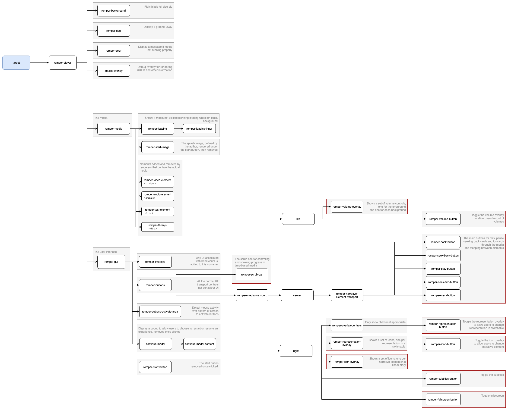
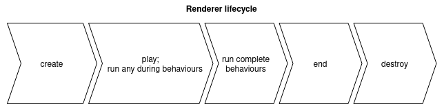

URL Parameters
==============

### URL Parameters for Playback
Two URL parameters can be used to set the state of one variable for playback.  These could be used, for example, to send a link that plays a particular version of a story.  Two parameters are both required:
- varName - the name of the variable.  This must be a variable defined in the story or one of the first two [internal variables](#internal-variables) below: `_portion_of_day` or `_day_of_week`.
- varVal - the value of the variable.  This must conform to the variable type. e.g., `true` or `false` for a boolean, a member of a `list` variable, etc.


### URL Parameters for Debugging
Below are the URL parameters that can be used to toggle features in StoryPlayer.  These are primarily related to debugging.
- overridePlayout - Takes 'ios' or 'dom'. Sets the playout engine.
- debugPlayout - Takes ```'trace' | 'debug' | info' | 'warn' | 'error' | 'fatal'```. Increases debugging in playout engines, if level is 'debug' or 'trace' will render scrub bar.
- overrideInactiveBuffering - Takes number in seconds. Changes the number of seconds to buffer inactive media.
- overrideActiveBuffering - Takes number in seconds. Changes the number of seconds to buffer media currently playing.
- debugShaka - Takes 'vv', 'v', 'debug' or 'info'. Sets debug level of Shaka when debugPlayout is on.
- disableLookahead - 'true' Stops preloading of next/previous elements
- addDetails - Takes 'true' this inserts the Narrative element name and Id onto the GUI layer in the top right of the player.
- overrideFormat- Takes either 'hls' or 'dash' Other values are ignored.
- cache - 'true'/'false' Only on sandbox and test. Toggles whether to fetch the story from the cache or S3 buckets
- debugUA - Takes 'true' - Creates a div element with the User agent and browser support for formats, and playout engines used.

Internal Variables
==================

StoryPlayer creates and manipulates some variables as it runs.  These are available for authors to query to control the story logic (e.g., a representation or a link condition can depend on the state of one or more of these).  The variables are as follows:

* `_day_of_week`: the day of the week (according to the client computer) at the time the experience was loaded.  A string that takes one of the following values:
    - `Sunday`
    - `Monday`
    - `Tuesday`
    - `Wednesday`
    - `Thursday`
    - `Friday`
    - `Saturday`
* `_portion_of_day`: the approximate time of day (according to the client computer) at the time the experience was loaded.  A string that takes one of the following values:
    - `Morning`: before 1200
    - `Afternoon`: between 1200 and 1659
    - `Evening`: after 1700
* `_path_history`: an array of UUIDs of the Narrative Elements that the user has visited so far.  If a user goes back in a story, that UUID is removed from the list.
* `_location_longitude`: the most recent record of the direction of view that the user has taken in a 360 scene (video or image).  This is a number variable which represents the view in the left-right dimension, expressed in degrees, and takes values between 0 and 359.  The player records this variable value every 2 seconds.
* `_location_latitude`: the most recent record of the direction of view that the user has taken in a 360 scene (video or image).  This is a number variable which represents the view in the up-down dimension, expressed in degrees, and takes values between -90 and 90.  The player records this variable value every 2 seconds.
* `_random_number`: returns a random number between 0 and 100 each time it is requested (i.e., the number does not persist across the story)

Document Object Model
=====================
The following diagram shows how the HTML elements that make up StoryPlayer are organised.  The elements are labelled with their primary CSS class name.  The blue `target` node at the root of the tree is the `<div>` that is passed into StoryPlayer when it is initiated.



Code Components and Data Flow
=============================

The logic of processing the [data model](https://github.com/bbc/object-based-media-schema) is shown in [this flow diagram](https://github.com/bbc/object-based-media-schema/blob/main/docs/SCHEMA.md/#story-logic-flow). This section briefly describes how the responsibilities for performing that are allocated amongst the different code components of StoryPlayer.

### Story Control

Each instance of StoryPlayer is an instance of a `Controller` that is created by `romper.js`.  This creates a `RenderManager`, which handles rendering of content, and two reasoners for determining which content is shown.  The `StoryReasoner` is responsible for evaluating links between Narrative Elements to determine which is taken (the first link in the array whose conditions evaluate to true), while the `RepresentationReasoner` is responsible for determining which Representation is rendered for a given Narrative Element (again, the first Representation in the RepresentationCollection whose conditions evaluate to true).  Both reasoners use a `DataResolver` that is passed in to StoryPlayer (although there is a default that is used if one is not provided); this is essentially the variable store.  Also passed in to StoryPlayer are:

* Story Fetchers, which fetch objects of the story data model from the Media Store
* A Media Fetcher, which handles fetching media assets (e.g., from CDNs)
* An Analytics Logger, which takes Analytics Events and processes them (e.g., write to a DB)

The `Controller` also determines whether the system meets the story requirements (as defined in the story meta), tests if the story is linear (and, if so, creates the chapter markers using the representation icons) and handles movement between elements of the story.

The `RenderManager` is responsible for creating and managing the Renderers that display each Narrative Element.  This involves using the `RepresentationReasoner` to determine which Representation will be used, then using the `RendererFactory` to find a Renderer that is capable of rendering it.  In order to achieve smooth playback, it also creates renderers for current, previous and next Narrative Elements so these are ready to play as soon as the story moves on to the next NarrativeElement (a change in the variable state requires these to be refreshed as the particular representation that should be played depends on the state of the variables).  The `RenderManager` creates a `Player` that all Renderers use, and which is responsible for creating the UI and handling the HTML/DOM that the browser displays.

#### Resume State
StoryPlayer uses local storage to record how far a user has got through an experience and the state of their variables.  When they revisit the page they will be given the opportunity to resume from where they were or to restart.  This option can be disabled by initiating StoryPlayer with the `saveSession: false` attribute; in this case the user will always start from the beginning of the story.

The `Controller` creates a `SessionManager` to handle this, which lasts for the duration of the page. When the page is reloaded the `SessionManager` is created again; the controller will check the existing state of the session and give the user options to resume current session or restart and create a new session.

The session state is one of the following enums
- ```'NEW'```: There is a new session created.
- ```'EXISTING'```: There is an existing session that can be resumed.
- ```'RESUME'```: A Session has been resumed
- ```'RESTART'```: The session will restart from a fresh.

Note that the session manager handles creating the session and fetching the existing session from the local storage. Handling variables data during the session is handled by the `DataResolver`.

### Rendering the UI
The `Player` builds the DOM tree for rendering the content and the UI.  It handles the overlay system, which is used to display multiple volume controls, chapter icons (for switching Narrative Elements), Representation icons (for switching Representations in a Switchable Representation).  It manages the Scrub Bar so it is associated with the appropriate video/audio and the rendering of icons to represent branch choices (the `Player` manages the rendering of these, but the logic is controlled from within the Renderer that is handling the Representation with which this behaviour is associated).  The `Player` creates and handles a `PlayoutEngine` that handles changes of AV media; either by handling multiple video elements or by changing the src of a single element.

### Renderer Lifecycle
The basic lifecycle of a renderer is shown below:



The `BaseRenderer` is the base class for all the Renderers and handles concerns that are common to all.  The rough lifecycle is that constructing a Renderer builds the necessary components for it to play (e.g., a `SimpleAVRenderer` fetches the media assets and gets the `PlayoutEngine` to queue them up).  When the Controller tells the RenderManager to change to the NarrativeElement that the Renderer is handling, the `willStart()` function is called.  This tells the `BehaviourRunner` to run any start behaviours for the Representation and the `PlayoutEngine` to move on to this media.  Once the behaviours have all completed, the `start()` function is called, which clears any behaviour DOM elements and starts rendering (e.g., video playback commences).  It also tests for during behaviours and queues these to run at the appropriate time.  The Renderer is responsible for ending itself, which is done by running the `complete()` function, e.g., when the video has completed.  The `complete()` function asks the `BehaviourRunner` to run any completed behaviours; once these have completed, the Renderer emits a COMPLETED event, which is heard by the RenderManager and passed on to the Controller.  The Controller then tells its StoryReasoner to move on to the next element; this fires events which the Controller listens for and handles, e.g., to tell the RenderManager handle a change in NarrativeElement.  The renderer's `destroy()` function is called when it is no longer either playing or held in the RenderManager's 'buffer' of next and previous NarrativeElements.  The Renderer monitor time passing during the main part of the renderer lifecycle. This monitors absolute time elapsed (compensating for time spent paused or with the window invisible) and allows DURING behaviours to occur at a set time into the element. Renderers representing media that can report a play head time (e.g., audio/video) inherit from `BaseMediaTimedRenderer` which delegates timing information to an underlying HTML media element. Renderers representing media that can not report a play head time (e.g., image/text) inherit from `BaseIntervalTimedRenderer` which provides timing information.

The diagram below extends the simple overview (above) to show the functions that are called to start each phase of the lifecycle and the events that are sent to the RenderManager that allow it to call them at the appropriate times.  For example, when a renderer has completed all its COMPLETED behaviours, it will fire the `COMPLETED` event to the RenderManager, which will call the `end()` function on the renderer and move to the next Narrative Element.


#### Behaviours
[Behaviours](https://github.com/bbc/object-based-media-schema/blob/main/docs/SCHEMA.md/#behaviours) are associated with Representations in the Data Model, and can be run at the start, middle, or end of an Element.  They are handled by the Renderer for the given Representation; this uses a `BehaviourRunner` to run the behaviours.  The BehaviourRunner passes each behaviour to the `BehaviourFactory`; which returns a `Behaviour` that is capable of handling it.  Some (e.g., pause) are generic enough to be handled by their own class for all Renderer types; other behaviours can only be handled by certain Representation types, or need to be handled differently for different Representation types; these are handled by the `BaseBehaviour`, which basically passes responsibility on to the Renderer for the Representation.  Each Renderer has a map that associates functions with the URNs of the behaviours it can handle; the function is called when the behaviour needs to be run and runs a callback when it is completed.  The behaviours are considered complete when all of those which are capable of being run have run their callbacks.

### Interpretation of User Interactions
There is considerable complexity in how user interactions influence the lifecycle.  For example, if a link choice behaviour has been applied to a Representation, what should the Next button on the transport bar do?  The following diagrams are intended to capture how StoryPlayer works.

#### Transport controls


#### Interaction with behaviours
The variables panel and link choice behaviours both allow for user interaction.  The following diagram shows how this affects the renderer lifecycle in StoryPlayer.

